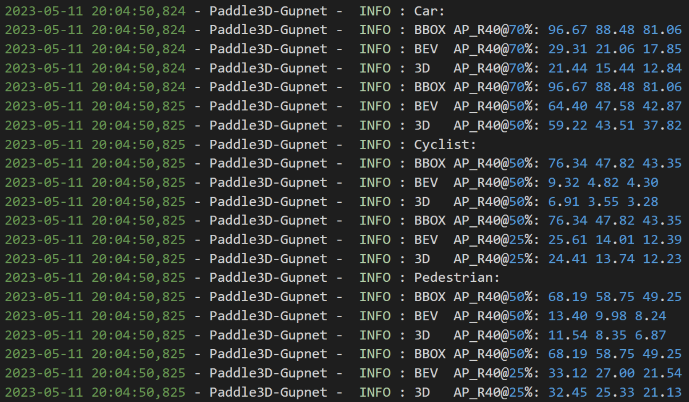

# Implementation of gupnet on paddle3d

## Special changes
```
|-paddle3d-gupnet(ROOT)
  |-configs
    |-gupnet_dla34_kitti.py      # 配置文件
  |-docs
    |-gupnet
      |-README.md	         # 复现说明文档
  |-paddle3d
    |-datasets
      |-kitti
        |-kitti_gupnet.py        # 数据集加载
        |-kitti_gupnet_utils.py  # 数据集加载辅助函数
        |-kitti_utils.py         # gupnet相关数据处理函数
    |-models
      |-detection
        |-gupnet
          |-gupnet.py            # 模型结构搭建
          |-gupnet_dla.py        # 特征提取网络结构
          |-gupnet_helper.py	 # 辅助函数
          |-gupnet_loss.py       # 损失
          |-gupnet_predicter.py  # 预测
          |-gupnet_processor.py  # 后处理
        |-optimizers
          |-lr_schedulers.py     # 定制WarmUp+MultiStep学习率
```

## Prepared

1. Modify the dataset root directory (`dataset_root`) in the config file (`configs\gupnet\gupnet_dla34_kitti.yml`)

2. Download the pre training weights of dla34 to the checkpoint folder

> 链接：https://pan.baidu.com/s/1NTqgwaBAq2jP2YJ_X8cmzw?pwd=swxl
>
> 提取码：swxl

### Install
[Installation Tutorial](https://github.com/PaddlePaddle/Paddle3D/blob/develop/docs/installation.md)

## Train

on one gpu:
```shell script
$ python tools/train.py --config configs/gupnet/gupnet_dla34_kitti.yml --batch_size 8 
```

## Val
```shell script
$ python tools/evaluate.py --config configs/gupnet/gupnet_dla34_kitti.yml --batch_size 8 --model output/epoch_140/model.pdparams
```
Modify the `model` parameters to the weights you have trained

## Best result:
Best car performance on the validation set:

| Code | Venue | Easy | Moderate\* | Hard |
| :--: | :---: | :--: | :------: | :--: |
| [Official](https://github.com/SuperMHP/GUPNet) | ICCV'21 | 23.19 | 16.23 | 13.57 |
| [repo](https://github.com/Xiaolong-RRL/paddle3d_gupnet) | ICCV'21 | 21.44 | 15.44 |12.84|


