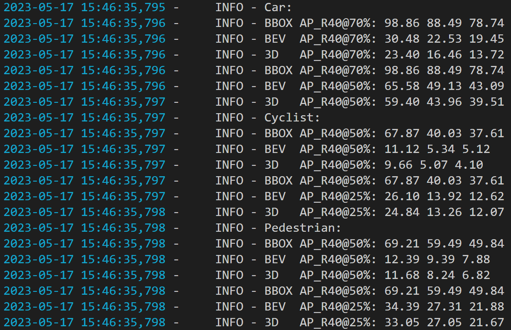

# Paddle3D复现GUPNet
> [Cite]: Lu Y, Ma X, Yang L, et al. Geometry uncertainty projection network for monocular 3d object detection[C]. Proceedings of the IEEE/CVF International Conference on Computer Vision. 2021: 3111-3121.
>
> [code](https://github.com/SuperMHP/GUPNet)
>
> [paper](https://arxiv.org/abs/2107.13774)
>
> [blog](https://zhuanlan.zhihu.com/p/394548357)

<br>

## 目录
* [模型结构对齐](#模型结构对齐)
* [数据读取对齐](#数据读取对齐)
* [前向对齐](#前向对齐)
* [验证对齐](#验证对齐)
* [损失对齐](#损失对齐)
* [反向对齐](#反向对齐)
* [训练对齐](#训练对齐)

<br>

## 模型结构对齐
> 通过

这一步骤主要为搭建模型的网络结构，包括backbone、neck以及head这三部分：

- backbone：使用dla34作为gupnet的主干网络，与smoke使用的dla34有3个不同点
    - smoke使用gn标准化，而gupnet则是普通的bn标准化
    - lever3和lever4最后`downsample`模块后，gupnet使用的dla34有`project`模块，而smoke使用的dla34则没有
    - 在整个backbone最后，gupnet使用的dla34有`avgpool`和`fc`模块，而smoke使用的dla34则没有
- neck：使用dlaup作为gupnet的neck网络，与smoke使用的dlaup有2个不同点
    - gupnet使用的dlaup基础conv2d模块的顺序为`conv2d+bn+relu`，而smoke的顺序则是`gn+relu+conv2d`
    - gupnet使用的dlaup只包含3层IDAUp，而smoke包含4层（最后额外多了一层IDAUp）


网络结构的文件路径为：`./论文复现文档/模型结构对齐/*.txt`，其中：

- `paddle_gupnet.txt`存放的是paddle版本的gupnet网络结构
- `torch_gupnet.txt`存放的是torch版本的gupnet网络结构
- `paddle_smoke.txt`存放的是paddle版本的smoke网络结构


<br>

## 数据读取对齐
> 提前准备好小批量数据kitti-mini，下载地址：[单目3D目标检测经典数据集：kitti-mini](https://download.csdn.net/download/weixin_43799388/87802887)


手动固定参数：
- 同一个数据集，设置`shuffle-False`，固定顺序读取
- 固定随机种子：`np.random.seed(444)`
- 固定数据增强的超参数

在遍历数据集的过程中，依次输出`__getitem__()`函数的每一个返回项的平均值，验证数据读取对齐，代码示例如下所示：

```python
ROOT_PATH = '/data1_4t/rrl/kitti-mini'

def build_paddle_data_pipeline():
    dataset_paddle = GUPKittiDataset_Paddle(root_dir=ROOT_PATH, mode='train')
    dataloader_paddle = paddle.io.DataLoader(dataset=dataset_paddle, batch_size=4, shuffle=False)

    for batch_idx, (inputs, calibs, coord_ranges, targets, info) in enumerate(dataloader_paddle):
        images_length = inputs.shape[0]
        img = inputs[0].numpy().transpose(1, 2, 0)
        images_mean = img.mean()
        labels_mean = targets['depth'].mean()
        calibsP2_mean = calibs.mean()
        return images_length, images_mean, labels_mean, calibsP2_mean, info


def build_torch_data_pipeline():
    cfg = {'random_flip': 1.0, 'random_crop': 1.0, 'scale': 0.4, 'shift': 0.1, 'use_dontcare': False,
           'class_merging': False, 'writelist': ['Pedestrian', 'Car', 'Cyclist'], 'use_3d_center': False}
    dataset_torch = GUPKittiDataset_Torch(root_dir=ROOT_PATH, split='train', cfg=cfg)
    dataloader_torch = DataLoader(dataset_torch, batch_size=4, shuffle=False)

    for batch_idx, (inputs, calibs, coord_ranges, targets, info) in enumerate(dataloader_torch):
        images_length = inputs.shape[0]
        img = inputs[0].numpy().transpose(1, 2, 0)
        images_mean = img.mean()
        labels_mean = targets['depth'].mean()
        calibsP2_mean = calibs.mean()
        return images_length, images_mean, labels_mean, calibsP2_mean, info


def test_data_pipeline():
    paddle_out = build_paddle_data_pipeline()
    print('paddle dataloader output')
    for i in range(len(paddle_out)):
        print(f'paddle_out[{i}]: {paddle_out[i]}')

    torch_out = build_torch_data_pipeline()
    print('\ntorch dataloader output')
    for i in range(len(torch_out)):
        print(f'torch_out[{i}]: {torch_out[i]}')

    pass


if __name__ == '__main__':
    test_data_pipeline()
```

固定随机种子 np.random.seed(444)，第一个batch的输出结果（4个输出信息分别是：images_length, images_mean, labels_mean, calibsP2_mean, info）如下所示：
```
paddle dataloader output
paddle_out[0]: 4
paddle_out[1]: -0.16234399378299713
paddle_out[2]: Tensor(shape=[1], dtype=float32, place=Place(gpu:0), stop_gradient=True,
       [0.22325000])
paddle_out[3]: Tensor(shape=[1], dtype=float32, place=Place(gpu:0), stop_gradient=True,
       [182.90878296])
paddle_out[4]: {'img_id': Tensor(shape=[4], dtype=int64, place=Place(gpu_pinned), stop_gradient=True,
       [0, 1, 3, 5]), 'img_size': Tensor(shape=[4, 2], dtype=int64, place=Place(gpu_pinned), stop_gradient=True,
       [[1224, 370 ],
        [1242, 375 ],
        [1242, 375 ],
        [1242, 375 ]]), 'bbox_downsample_ratio': Tensor(shape=[4, 2], dtype=float64, place=Place(gpu_pinned), stop_gradient=True,
       [[3.82500000, 3.85416667],
        [3.88125000, 3.90625000],
        [3.88125000, 3.90625000],
        [3.88125000, 3.90625000]])}

torch dataloader output
torch_out[0]: 4
torch_out[1]: -0.16234399378299713
torch_out[2]: 0.22325000166893005
torch_out[3]: 182.9087677001953
torch_out[4]: {'img_id': tensor([0, 1, 3, 5]), 'img_size': tensor([[1224,  370],
        [1242,  375],
        [1242,  375],
        [1242,  375]]), 'bbox_downsample_ratio': tensor([[3.8250, 3.8542],
        [3.8813, 3.9062],
        [3.8813, 3.9062],
        [3.8813, 3.9062]], dtype=torch.float64)}
```

<br>

## 前向对齐
在数据集读取对齐的基础上，加载相同的预训练模型，输出模型第一次前向预测信息的平均值：

```python
BATCH = 4
ROOT_PATH = '/data1_4t/rrl/kitti-mini'
mean_size = np.array([[1.76255119, 0.66068622, 0.84422524],
                      [1.52563191462, 1.62856739989, 3.88311640418],
                      [1.73698127, 0.59706367, 1.76282397]])


def forward_paddle():
    print(paddle.device.get_device())
    paddle.device.set_device('gpu:0')  # 把get—device的结果直接复制进去
    # device = torch.device("cuda:0" if torch.cuda.is_available() else "cpu")

    # load paddle model
    paddle_model = gupnet_paddle()
    paddle_model.eval()
    paddle_state_dict = paddle.load(
        "/home/rrl/det3d/paddle3d-1.0/checkpoint/best_single_gpu_paddle.pdparams")
    paddle_model.set_dict(paddle_state_dict)

    dataset_paddle = GUPKittiDataset_Paddle(
        dataset_root=ROOT_PATH, mode='train')
    dataloader_paddle = paddle.io.DataLoader(
        dataset=dataset_paddle, batch_size=BATCH, shuffle=False)
    for batch_idx, (inputs, calibs, coord_ranges, targets, info) in enumerate(dataloader_paddle):
        print(f'[paddle] inputs mean: {inputs.mean()}')
        paddle_out = paddle_model(
            inputs, coord_ranges, calibs, targets, K=50, mode='test')
        for ret in paddle_out.keys():
            if paddle_out[ret].dtype == paddle.bool:
                print(f'[paddle] {ret} mean: {paddle_out[ret]}')
            else:
                print(f'[paddle] {ret} mean: {paddle_out[ret].mean()}')
        break


def forward_torch():
    device = torch.device("cuda:0" if torch.cuda.is_available() else "cpu")
    torch_model = gupnet_torch(
        backbone='dla34', neck='DLAUp', mean_size=mean_size).to(device)
    torch_model.eval()
    torch_state_dict = torch.load(
        "/home/rrl/det3d/paddle3d-1.0/checkpoint/best_single_gpu.pth")
    torch_state_dict = torch_state_dict['model_state']
    torch_model.load_state_dict(torch_state_dict)

    cfg = {'random_flip': 1.0, 'random_crop': 1.0, 'scale': 0.4, 'shift': 0.1, 'use_dontcare': False,
           'class_merging': False, 'writelist': ['Pedestrian', 'Car', 'Cyclist'], 'use_3d_center': True}
    dataset_torch = GUPKittiDataset_Torch(
        root_dir=ROOT_PATH, split='train', cfg=cfg)
    dataloader_torch = DataLoader(
        dataset_torch, batch_size=BATCH, shuffle=False)

    for batch_idx, (inputs, calibs, coord_ranges, targets, info) in enumerate(dataloader_torch):
        inputs = inputs.to(device)
        calibs = calibs.to(device)
        coord_ranges = coord_ranges.to(device)
        for key in targets.keys():
            targets[key] = targets[key].to(device)
        print(f'[torch] inputs mean: {inputs.mean()}')
        torch_out = torch_model(inputs, coord_ranges,
                                calibs, targets, K=50, mode='train')
        for ret in torch_out.keys():
            if torch_out[ret].dtype == torch.bool:
                print(f'[torch] {ret} mean: {torch_out[ret]}')
            else:
                print(f'[torch] {ret} mean: {torch_out[ret].mean()}')

        break


def main():
    '''
    模型前向对齐
    '''
    # forward_paddle()
    forward_torch()
    pass


if __name__ == '__main__':
    main()
```

输出结果如下所示：

```
[paddle] model output:
[paddle] inputs mean: Tensor(shape=[1], dtype=float32, place=Place(gpu:0), stop_gradient=True,
       [-0.16234401])
[paddle] heatmap mean: Tensor(shape=[1], dtype=float32, place=Place(gpu:0), stop_gradient=False,
       [-11.74082184])
[paddle] offset_2d mean: Tensor(shape=[1], dtype=float32, place=Place(gpu:0), stop_gradient=False,
       [1.45843732])
[paddle] size_2d mean: Tensor(shape=[1], dtype=float32, place=Place(gpu:0), stop_gradient=False,
       [45.59632111])
[paddle] train_tag mean: Tensor(shape=[50], dtype=bool, place=Place(gpu:0), stop_gradient=True,
       [True, True, True, True, True, True, True, True, True, True, True, True,
        True, True, True, True, True, True, True, True, True, True, True, True,
        True, True, True, True, True, True, True, True, True, True, True, True,
        True, True, True, True, True, True, True, True, True, True, True, True,
        True, True])
[paddle] heading mean: Tensor(shape=[1], dtype=float32, place=Place(gpu:0), stop_gradient=False,
       [-2.58687258])
[paddle] depth mean: Tensor(shape=[1], dtype=float32, place=Place(gpu:0), stop_gradient=False,
       [6.80124092])
[paddle] offset_3d mean: Tensor(shape=[1], dtype=float32, place=Place(gpu:0), stop_gradient=False,
       [0.53001964])
[paddle] size_3d mean: Tensor(shape=[1], dtype=float32, place=Place(gpu:0), stop_gradient=False,
       [-0.02508870])
[paddle] h3d_log_variance mean: Tensor(shape=[1], dtype=float32, place=Place(gpu:0), stop_gradient=False,
       [-5.05835581])

[torch] model output:
[torch] inputs mean: -0.16234400868415833
[torch] heatmap mean: -11.740821838378906
[torch] offset_2d mean: 1.458437442779541
[torch] size_2d mean: 45.5963249206543
[torch] train_tag mean: tensor([True, True, True, True, True, True, True, True, True, True, True, True,
        True, True, True, True, True, True, True, True, True, True, True, True,
        True, True, True, True, True, True, True, True, True, True, True, True,
        True, True, True, True, True, True, True, True, True, True, True, True,
        True, True], device='cuda:0')
[torch] heading mean: -2.586872100830078
[torch] depth mean: 6.801241397857666
[torch] offset_3d mean: 0.5300195813179016
[torch] size_3d mean: -0.025088684633374214
[torch] h3d_log_variance mean: -5.058355808258057
```

<br>

## 验证对齐
将gupnet官方训练的checkpoint转换为paddle版本权重，并加载到model中，转换脚本如下：
```python 
import torch
import paddle
import numpy as np
from tqdm import tqdm
import os

def torch2paddle():
    torch_path = './runs/torch-checkpoint'
    paddle_path =  './runs/paddle-checkpoint'

    for _, filename in enumerate(os.listdir(torch_path)):
        model_path = os.path.join(torch_path, filename)
        torch_state_dict = torch.load(model_path)
        paddle_state_dict = {}
        torch_state_dict = torch_state_dict['model_state']
        for k in tqdm(torch_state_dict):
            if "num_batches_tracked" in k:
                continue
            v = torch_state_dict[k].detach().cpu().numpy()
            # v = np.round(v, decimals=4)  # 只保留4位小数
            k = k.replace("running_var", "_variance")
            k = k.replace("running_mean", "_mean")
            # if k not in model_state_dict:
            if False:
                print(k)
            else:
                paddle_state_dict[k] = v
        paddle_save_path = os.path.join(paddle_path, filename[:-4]+'.pdparams')
        paddle.save(paddle_state_dict, paddle_save_path)
        print('Conversion Complete!!')


if __name__ == "__main__":
    torch2paddle()


```
在验证集上测试指标，结果如下：



<br>

## 损失对齐
模型前向输出和数据加载一致，也就是损失的两个输入一致，验证损失的输出是否一致

<br>

## 反向对齐
在模型一次前向损失对齐的基础上，让模型run起来，比较前2个epoch内每一轮损失是否一致，前提条件：
- 加载相同的预训练模型
- 训练数据集相同，且读取方式相同（shuffle=False）
- 设置相同的随机种子

验证结果保存在：`./论文复现文档/反向对齐/*.txt`，其中：
- `paddle_backword.txt`：为paddle版本gupnet的前10个epoch中，每隔20个batchsize输出的loss信息
- `torch_backword.txt`：为torch版本gupnet的前10个epoch中，每隔20个batchsize输出的loss信息

<br>

## 训练对齐
在kitti-val数据集上，3D_AP_R40@70%未达标

## Merge条件
- 所有修改都在configs文件夹和paddle3d文件夹中
- 可以直接调用train.py以及trainer.py文件进行训练和测试
## 目前遇到的困难：
- 学习率策略：前5个epoch采用cosine形式的warmup，之后采取steplr形式，在90和120个epoch分别减小10倍，一共训练140个epoch
- 训练策略：因为HTL的存在，需要先计算一个epoch的loss，然后才开始正式训练
